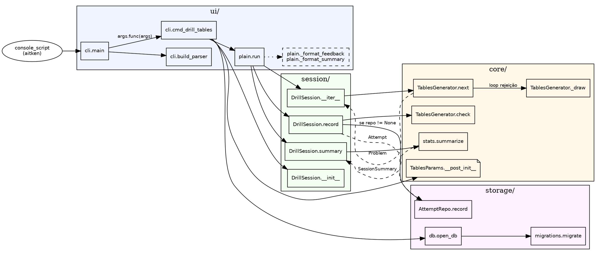

# aitken

Treinador de aritmética mental com foco em **fluência por latência**, não só acerto. Inspirado nas técnicas de calculadores profissionais (Aitken, Benjamin, Lemaire): cálculo da esquerda para a direita, criss-cross, close-together, diagnóstico de pares lentos da tabuada e repetição espaçada ponderada por tempo de resposta.

## Motivação

Em aritmética mental, saber a resposta não basta — o gargalo real é **latência**. Um par da tabuada respondido em 4 segundos trava toda a cadeia de uma conta de 3 dígitos. Este projeto cronometra cada resposta, identifica os pares lentos (tipicamente 6×7, 7×8, 8×9, pares com 12), agenda revisões com SM-2 ponderado por tempo e libera níveis superiores (2d×2d, 3d×1d, quadrados, atalhos) apenas quando a latência mediana do nível atual cai abaixo de um limiar configurável.

## Requisitos

Python ≥ 3.14.

## Instalação

```bash
python -m venv .venv
source .venv/bin/activate
pip install -e ".[dev]"
```

## Uso

```bash
aitken drill tables                              # sessão de tabuada (30 problemas, faixa 2-9)
aitken drill tables --count 30 --seed 42         # reproduzível com seed fixa
aitken drill tables --min 2 --max 19             # estende a faixa (inclui 10-19)
aitken drill tables --include-trivial            # inclui pares com ×0 e ×1
aitken drill tables --no-persist                 # não grava no banco
```

Outros módulos de drill (quadrados, multidígito, atalhos), `aitken diagnostic`, `aitken stats` e `aitken plot` estão listados em [Funcionalidades](#funcionalidades).


## Funcionalidades

Linhas marcadas com ✗ são planejadas — o nome exato do comando pode mudar quando forem implementadas.

> **Política padrão de todo drill: retry-on-wrong.** Toda sessão de treino reapresenta o mesmo problema sempre que a resposta estiver errada, até ele ser respondido corretamente. `--count N` conta *problemas distintos a dominar*; tentativas erradas não consomem desse orçamento. A resposta certa nunca é exibida em caso de erro — revelá-la esvaziaria o retry.

| Funcionalidade | Descrição | Como chamar | Implementado |
| --- | --- | --- | --- |
| Treino de tabuada | Sessão cronometrada de multiplicações na faixa configurada (padrão 2-9, estensível até qualquer inteiro). Respostas erradas são reapresentadas até o usuário acertar (retry-on-wrong). Imprime feedback por tentativa e resumo de acertos + latência ao final. Aceita `--count`, `--min`, `--max`, `--seed`, `--include-trivial`, `--no-persist`. | `aitken drill tables` | ✓ |
| Histórico persistente | Cada tentativa é gravada em SQLite local (`~/.local/share/aitken/aitken.db` por padrão, respeitando `$XDG_DATA_HOME`). Base para as estatísticas e progressão futuras. | automático em qualquer `drill` (desabilitável com `--no-persist`) | ✓ |
| Treino de quadrados | Sessão cronometrada de quadrados até 25². | `aitken drill squares` | ✗ |
| Treino multidígito | Multiplicações 2d×1d, 2d×2d, 3d×1d, 3d×2d, 3d×3d. | `aitken drill multidigit` | ✗ |
| Treino de atalhos | Operações com atalhos mentais: ×11, ×25, ×125, (10a+5)². | `aitken drill tricks` | ✗ |
| Diagnóstico de fraquezas | 100 pares aleatórios com mapa dos pares mais lentos, para priorizar estudo. | `aitken diagnostic` | ✗ |
| Estatísticas agregadas | Latência mediana e p90 por nível ao longo de todo o histórico. | `aitken stats` | ✗ |
| Gráficos de evolução | Gráficos semanais de acerto e latência gerados via matplotlib. | `aitken plot` | ✗ |
| Repetição espaçada (SM-2) | Amostragem ponderada por latência que prioriza pares lentos em vez de sortear uniformemente. | automático em `drill` | ✗ |
| Progressão automática de níveis | Desbloqueio do próximo nível (ex.: 2d×2d após tabuada) quando a latência mediana cai abaixo do limiar configurado. | automático | ✗ |
| Export de histórico | Export das tentativas em CSV ou JSON para análise externa. | `aitken export` | ✗ |
| Modo Textual (TUI) | Interface interativa em terminal com painel de stats ao vivo e heatmap de latência por par. | `aitken tui` | ✗ |
| Major System | Apoio mnemônico (Major System) para memória de trabalho em 3d×3d e 4d×4d. | integrado ao `drill multidigit` | ✗ |


## Arquitetura

Quatro camadas com dependências em um único sentido:

```
ui/  →  session/  →  storage/
                 ↘            ↘
                   core/  ←───┘
```

- **`core/`** — lógica pura: geradores de problemas, scheduler SM-2, regras de progressão, estatísticas. Sem I/O, sem UI, sem SQLite.
- **`storage/`** — adaptador SQLite. Depende apenas dos tipos de `core/`.
- **`session/`** — casos de uso (DrillSession, DiagnosticSession). Orquestra `core/` + `storage/`. Hoje devolve resultados de forma síncrona; `session/events.py` fica reservado para uma API baseada em eventos que UIs assíncronas (Textual, GUI) consumirão sem tocar em `core/`.
- **`ui/`** — `ui/plain.py` é o adaptador de terminal síncrono que hoje executa todas as sessões. `ui/textual/` e `ui/plot.py` são ganchos para adaptadores futuros que consomem os mesmos contratos de `session/`.


## Implementação detalhada

Esta seção expande o diagrama de quatro camadas seguindo uma sessão real — `aitken drill tables --count 30 --seed 42` — da linha de comando até o `INSERT` no SQLite, e termina com um grafo `dot` das chamadas. O objetivo é que um leitor novo consiga abrir qualquer arquivo do projeto sabendo em que papel ele entra.

### Camadas e responsabilidades

A camada **`core/`** contém apenas lógica pura: geradores, estatísticas, tipos imutáveis. Nenhum módulo importa `sqlite3`, `argparse`, `print` ou `input`. A consequência prática é que todos os testes de `core/` usam um `random.Random` com seed fixo, sem fixtures, sem `tmp_path`, sem `capsys`. Se amanhã trocarmos SQLite por Postgres, `core/` não tem uma linha alterada.

A camada **`storage/`** fala `sqlite3` e nada mais além dos tipos de `core/`. `AttemptRepo` recebe a conexão pronta no construtor em vez de abrir a própria, o que transforma cada teste em um caminho de três linhas: `open_db(tmp_path / "t.db")`, instanciar o repo, rodar. Pragmas, migrações e timestamps ficam isolados em `storage/db.py` e `storage/migrations.py` — quem usa o repo nunca precisa pensar neles.

A camada **`session/`** orquestra mas não decide apresentação. `DrillSession` é um iterável: `__iter__` produz o próximo `Problem` chamando `generator.next(rng)`, `record(problem, answer, elapsed_ms)` avalia via `generator.check`, monta o `Attempt` e, se houver repo, persiste. A sessão nunca cronometra nem lê input — o driver faz isso e devolve o `elapsed_ms`. Esse é o contrato que qualquer UI (terminal, TUI, GUI futura) satisfaz.

A camada **`ui/`** é o único lugar onde existem `input()`, `print()` e `time.perf_counter()`. `plain.run` é o adaptador atualmente em produção; qualquer outro (Textual, web) implementa uma função análoga consumindo a mesma sessão.

### Tipos de domínio

Quatro dataclasses formam o vocabulário compartilhado entre as camadas:

- **`Problem`** (`src/aitken/core/problem.py`) — `module_id`, `key` canônica (ex.: `tables:7x8` agrupa estatisticamente 7×8 e 8×7 quando `commutative_pairs=True`), `prompt` legível, `expected_answer` em string.
- **`Attempt`** (`src/aitken/core/problem.py`) — `problem`, `user_answer`, `correct`, `elapsed_ms`. É o que entra no banco.
- **`TablesParams`** (`src/aitken/core/generators/tables.py`) — `frozen=True` com `__post_init__` validando faixas. Frozen porque parâmetros circulam entre threads e módulos; mutação silenciosa nunca é o que o usuário quer.
- **`SessionSummary`** (`src/aitken/core/stats.py`) — `total`, `correct`, `accuracy`, `median_ms`, `p90_ms` (ou `None` se `total < 10`), `slowest`.

### Cadeia de execução de um comando

Considere:

```bash
aitken drill tables --count 30 --seed 42
```

**Parsing (`ui/` entrando em `cli.py`)**

1. O console script `aitken` (registrado em `[project.scripts]` do `pyproject.toml`) chama `aitken.cli:main(argv)`.
2. `main` monta o parser via `build_parser()`: subparser `drill` → sub-subparser `tables` configurado em `_add_tables_subparser`.
3. `parser.parse_args(argv)` retorna um `Namespace` onde `args.func` já aponta para `cmd_drill_tables` (via `p.set_defaults(func=...)`). Esse truque dispensa `if/elif` na `main` — adicionar um novo módulo é só registrar mais um subparser.
4. `main` chama `args.func(args)`. `ValueError` levantado em qualquer camada é capturado aqui e convertido em mensagem no `stderr` com `rc=1`; demais exceções propagam com stack trace.

**Bootstrap (`storage/` e `core/`)**

5. `cmd_drill_tables` instancia `TablesParams(min_factor=2, max_factor=9, commutative_pairs=True, exclude_trivial=True)`. O `__post_init__` rejeita `min_factor < 0`, `min_factor > max_factor` e faixas que ficam vazias após `exclude_trivial`. Com os params válidos, constrói `TablesGenerator(params)` e `Random(args.seed)` — o seed fixo é o que dá reprodutibilidade.
6. Como `--no-persist` não foi passado, chama `open_db(args.db)`. A função cria o diretório pai se necessário, abre a conexão em autocommit e aplica três pragmas: `journal_mode=WAL` (leituras concorrentes não bloqueiam escritas), `foreign_keys=ON` (SQLite desabilita por padrão), `synchronous=NORMAL` (perdemos só a última transação em crash do SO, não do processo). Em seguida chama `migrate(conn)`, que lê a tabela `schema_version`, aplica só as migrações pendentes e é idempotente — rodar duas vezes é no-op.
7. `AttemptRepo(conn)` embrulha a conexão (stateless além disso). `DrillSession(generator, repo, max_problems=30, rng)` valida `max_problems > 0` e guarda as quatro referências injetadas.

**Loop de iteração (`ui/` ↔ `session/` ↔ `core/`)**

8. `cmd_drill_tables` delega para `plain.run(session)`.
9. `plain.run` itera `for problem in session:`, lendo a posição atual via `session.current_position`. Isso dispara `DrillSession.__iter__`, que — se `self._pending_retry` estiver setado — reemite o mesmo problema sem decrementar `self._remaining`; caso contrário decrementa, incrementa `_position` e faz `yield self._generator.next(self._rng)`. O loop segue enquanto restar problema distinto a gerar **ou** um retry pendente.
10. `TablesGenerator.next(rng)` chama `_draw(rng)` em um laço de amostragem por rejeição (descarta pares com fator `< 2` quando `exclude_trivial=True`), calcula a `key` canônica (`min(a,b), max(a,b)` quando `commutative_pairs=True`) e devolve um `Problem` com `prompt = "a × b"` e `expected_answer = str(a*b)`.

**Loop de captura (`ui/` ↔ `session/`)**

11. De volta ao `plain.run`: `start = time.perf_counter()` (monotônico, imune a ajustes de relógio), `answer = ask(prompt)` (onde `ask` é o `input_fn` injetado ou `builtins.input`), `elapsed_ms = int((time.perf_counter() - start) * 1000)`. Um `EOFError`/`KeyboardInterrupt` quebra o loop graciosamente — o resumo ainda é gerado com os `attempts` que chegaram até ali.
12. `session.record(problem, answer, elapsed_ms)` valida `elapsed_ms >= 0`, chama `generator.check(problem, user_answer)` (`TablesGenerator.check` faz `strip()`, tenta `int()`, compara — nunca levanta), constrói o `Attempt` e apenda. Se `self._repo is not None`, chama `repo.record(attempt)` — o `INSERT` inclui `created_at = datetime.now(UTC).isoformat(timespec="milliseconds")`. Ao final, `self._pending_retry = None if correct else problem` — é essa atribuição que implementa o retry-on-wrong: na próxima iteração, `__iter__` vê o campo preenchido e reemite o mesmo `Problem`.
13. `plain.run` formata o retorno via `_format_feedback(attempt)` (`ok (Xs)` no acerto, `x errado (sua: 'Z', Xs)` no erro — a resposta certa **não** é revelada, porque o problema volta logo em seguida) e escreve no `output`.

**Encerramento**

14. Esgotados os 30 problemas distintos **com retry exaurido em cada um** (ou após abortar), `plain.run` chama `session.summary()`, que simplesmente delega a `stats.summarize(self._attempts)`. A função é pura: recebe a lista (que pode conter múltiplas entradas por problema devido aos retries), computa `total`, `correct`, `accuracy`, `median_ms`, `p90_ms` (via `statistics.quantiles(..., n=10)[8]`, só se houver ≥ 10 amostras) e o par mais lento. `plain.run` escreve o bloco via `_format_summary` e retorna o `SessionSummary`.
15. De volta a `cmd_drill_tables`, o bloco `finally` fecha a conexão — mesmo se qualquer passo anterior tiver levantado. `main` retorna `int(args.func(args))` e o processo encerra com `rc=0`.

### Grafo de chamadas

Arestas sólidas são chamadas diretas; arestas tracejadas mostram o dado retornado/passado entre camadas. Clusters reproduzem as quatro camadas da arquitetura. GitHub não renderiza DOT — para ver o grafo, cole o bloco em `dot -Tsvg` ou em <https://dreampuf.github.io/GraphvizOnline>.



`DiagnosticSession` (roadmap) seguirá o mesmo formato com uma sessão diferente no lugar de `DrillSession`; `ui/textual/` consumirá os mesmos contratos via eventos definidos em `session/events.py`.

### UI desacoplada

A assinatura é `plain.run(session, *, output: TextIO | None = None, input_fn: Callable[[str], str] | None = None)`. Testes em `tests/ui/test_plain.py` instanciam um `_FakeInput` com uma lista de respostas pré-programadas e passam um `io.StringIO` como `output` — o loop roda até o fim sem tocar em `stdin`/`stdout`. Uma futura UI Textual ou GUI implementa um `run` análogo consumindo `DrillSession` via iteração + `record()`; `core/`, `session/` e `storage/` ficam intactos.

### Persistência opcional

`--no-persist` passa `repo=None` para `DrillSession`. Dentro de `record`, o teste é literal: `if self._repo is not None: self._repo.record(attempt)`. Não há `NullRepo`, nem `MemoryRepo` — um `None` bem checado evita uma hierarquia inteira. E como `migrate(conn)` é idempotente, rodar `aitken` em uma máquina nova cria o banco e o schema sem passos manuais; rodar de novo não faz nada.

### Adicionando um novo gerador

- Implementar o `Protocol` `Generator` em `src/aitken/core/generators/base.py`: atributo `module_id: str`, método `next(rng: Random) -> Problem`, método `check(problem: Problem, user_answer: str) -> bool`. Nenhuma herança, só satisfazer o contrato.
- Opcional: um dataclass `frozen=True` de parâmetros com `__post_init__` validador, seguindo `TablesParams`.
- Em `cli.py`, espelhar `_add_tables_subparser` e escrever um `cmd_*` análogo a `cmd_drill_tables`. Os arquivos de outras camadas não mudam.
- `core/progression.py` e `core/scheduler.py` hoje são stubs — eles abrigam, respectivamente, as regras de desbloqueio por nível e o agendador SM-2 ponderado por latência descritos na Motivação.

## Desenvolvimento

```bash
pytest                    # testes
ruff check src tests      # lint
ruff format src tests     # formatação
mypy src/aitken           # tipos
```
