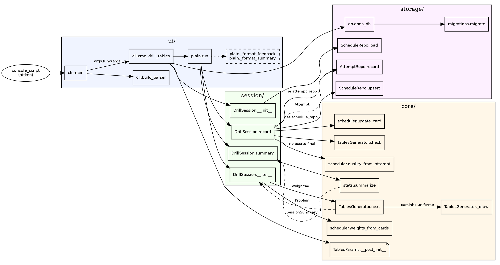

# aitken

Treinador de aritmética mental com foco em **fluência por latência**, não só acerto. Inspirado nas técnicas de calculadores profissionais (Aitken, Benjamin, Lemaire): cálculo da esquerda para a direita, criss-cross, close-together, diagnóstico de pares lentos da tabuada e repetição espaçada ponderada por tempo de resposta.

## Motivação

Em aritmética mental, saber a resposta não basta — o gargalo real é **latência**. Um par da tabuada respondido em 4 segundos trava toda a cadeia de uma conta de 3 dígitos. Este projeto cronometra cada resposta, identifica os pares lentos (tipicamente 6×7, 7×8, 8×9, pares com 12), agenda revisões com SM-2 ponderado por tempo e libera níveis superiores (2d×2d, 3d×1d, quadrados, atalhos) apenas quando a latência mediana do nível atual cai abaixo de um limiar configurável.

## Requisitos

Python ≥ 3.14.

## Instalação

```bash
python -m venv .venv
source .venv/bin/activate
pip install -e ".[dev]"
```

## Uso

```bash
aitken drill tables                              # tabuada (default: 30 problemas, faixa 2-9)
aitken drill tables --min 2 --max 19             # tabuada estendida
aitken drill squares                             # quadrados (default: 11² a 25²; 2²-10² já saem da tabuada)
aitken drill cubes                               # cubos (default: 3³ a 10³)
aitken drill factorial                           # fatoriais de 0! a 10! (faixa fixa)
```

### Parâmetros comuns a todo drill

Todos os subcomandos `aitken drill <módulo>` aceitam as mesmas flags de sessão:

- `--count N` / `-n N` — número de problemas *distintos* a dominar (default 30; `factorial` usa 20 por ter pool menor).
- `--no-persist` — não grava tentativas nem o estado SM-2 desta sessão.

### Flags específicas dos módulos

Além dos parâmetros comuns, `tables`, `squares` e `cubes` expõem flags próprias para ajustar a faixa amostrada e os filtros. `factorial` não tem flags adicionais — o pool é fixo de `0!` a `10!`.

| Flag | Módulos | Default | Efeito |
| --- | --- | --- | --- |
| `--min N` | `tables`, `squares`, `cubes` | `tables`: 2 · `squares`: 11 · `cubes`: 3 | Menor valor da faixa amostrada — fator na tabuada; base em quadrados e cubos. |
| `--max N` | `tables`, `squares`, `cubes` | `tables`: 9 · `squares`: 25 · `cubes`: 10 | Maior valor da faixa amostrada. |
| `--include-trivial` | `tables`, `squares`, `cubes` | exclui triviais | Passar a flag mantém os casos triviais no pool: `×0`/`×1` na tabuada, `0²`/`1²` em quadrados, `0³`/`1³` em cubos. Por default ficam fora porque não exercitam cálculo mental — sabê-los ≠ treiná-los. |
| `--no-commutative` | `tables` | agrupa comutativos | Por default, `7×8` e `8×7` compartilham a chave SM-2 canônica `tables:7x8`, o que significa **mesmo `Card`, mesmo estado de aprendizado** — acertar um conta como reforço do outro. Passar a flag separa em duas chaves distintas (`tables:7x8` e `tables:8x7`) e faz o SM-2 tratá-los como itens independentes. Útil apenas se você considera que a ordem de apresentação altera a dificuldade cognitiva e quer medir cada lado em separado. |

Cada flag também aparece em `aitken drill <módulo> --help` com a mesma descrição resumida.

### Onde fica o banco

O histórico é gravado em `data/aitken.db`, dentro do próprio repositório. Como o projeto vive numa pasta sincronizada pelo OneDrive, o banco viaja entre máquinas sem precisar de export, env var ou config file — clonou a pasta, já tem o histórico.

A flag `--db PATH` existe como escape hatch para apontar a sessão para um arquivo alternativo (usada principalmente pelos testes para isolar `tmp_path`).

Outros módulos planejados (multidígito, atalhos) e `aitken diagnostic` estão listados em [Funcionalidades](#funcionalidades).


## Funcionalidades

Linhas marcadas com ✗ são planejadas — o nome exato do comando pode mudar quando forem implementadas.

> **Políticas padrão de todo drill.**
>
> - *Retry-on-wrong*: respostas erradas reapresentam o mesmo problema até serem acertadas. `--count N` conta problemas distintos a dominar; tentativas erradas não consomem desse orçamento. A resposta certa nunca é exibida no erro — revelá-la esvaziaria o retry.
> - *SM-2 ponderado por latência*: a amostragem prioriza pares com `ease_factor` baixo (difíceis, lentos ou recém-errados) sobre pares já dominados. Ao fim de cada ciclo de retry o `Card` da chave é atualizado; erros em qualquer ponto do ciclo rebaixam o item para "re-aprender" (quality ≤ 2 → streak zera, `ease_factor` cai 0.2). Pares nunca vistos têm prioridade máxima, para que a sessão cubra o universo antes de voltar aos conhecidos.

| Funcionalidade | Descrição | Como chamar | Implementado |
| --- | --- | --- | --- |
| Treino de tabuada | Sessão cronometrada de multiplicações na faixa configurada (padrão 2-9, estensível até qualquer inteiro). Amostragem por SM-2 + retry-on-wrong. Aceita `--min`, `--max`, `--include-trivial`, `--no-commutative` além dos [parâmetros comuns](#par%C3%A2metros-comuns-a-todo-drill). | `aitken drill tables` | ✓ |
| Treino de quadrados | Sessão de `N²` para `N` em `[--min, --max]` (default 11–25; `2²` a `10²` já saem da tabuada, daí o corte). Aceita `--min`, `--max`, `--include-trivial`. | `aitken drill squares` | ✓ |
| Treino de cubos | Sessão de `N³` para `N` em `[--min, --max]` (default 3–10; `2³ = 8` é trivial). Aceita `--min`, `--max`, `--include-trivial`. | `aitken drill cubes` | ✓ |
| Treino de fatoriais | Sessão de `N!` com `N` sorteado no pool fixo `{0, 1, ..., 10}` — sem parâmetros de faixa. | `aitken drill factorial` | ✓ |
| Histórico persistente | Cada tentativa é gravada na tabela `attempts` e o estado SM-2 (`ease_factor`, streak de acertos) por chave em `schedule`. Banco em SQLite dentro do projeto (`data/aitken.db`). Para análise ad-hoc, o banco é consultável direto com `sqlite3` ou qualquer ferramenta SQL. | automático em qualquer `drill` (desabilitável com `--no-persist`) | ✓ |
| Treino multidígito | Multiplicações 2d×1d, 2d×2d, 3d×1d, 3d×2d, 3d×3d. | `aitken drill multidigit` | ✗ |
| Treino de atalhos | Operações com atalhos mentais: ×11, ×25, ×125, (10a+5)². | `aitken drill tricks` | ✗ |
| Diagnóstico de fraquezas | Bateria de 100 pares aleatórios; produz mapa dos pares mais lentos, estatísticas agregadas de latência (mediana, p90) e gráficos semanais de evolução (matplotlib). | `aitken diagnostic` | ✗ |


## Arquitetura

Quatro camadas com dependências em um único sentido:

```
ui/  →  session/  →  storage/
                 ↘            ↘
                   core/  ←───┘
```

- **`core/`** — lógica pura: geradores de problemas, scheduler SM-2 (`ease_factor`, streak, quality mapping), estatísticas. Sem I/O, sem UI, sem SQLite. `core/progression.py` está reservado para regras futuras de desbloqueio de nível.
- **`storage/`** — adaptador SQLite. Depende apenas dos tipos de `core/`.
- **`session/`** — casos de uso (DrillSession, DiagnosticSession). Orquestra `core/` + `storage/`. Hoje devolve resultados de forma síncrona; `session/events.py` fica reservado para uma API baseada em eventos que UIs assíncronas (Textual, GUI) consumirão sem tocar em `core/`.
- **`ui/`** — `ui/plain.py` é o adaptador de terminal síncrono que hoje executa todas as sessões. `ui/textual/` e `ui/plot.py` são ganchos para adaptadores futuros que consomem os mesmos contratos de `session/`.


## Implementação detalhada

Esta seção expande o diagrama de quatro camadas seguindo uma sessão real — `aitken drill tables --count 30` — da linha de comando até o `INSERT` no SQLite, e termina com um grafo `dot` das chamadas. O objetivo é que um leitor novo consiga abrir qualquer arquivo do projeto sabendo em que papel ele entra.

### Camadas e responsabilidades

A camada **`core/`** contém apenas lógica pura: geradores, estatísticas, tipos imutáveis. Nenhum módulo importa `sqlite3`, `argparse`, `print` ou `input`. A consequência prática é que todos os testes de `core/` usam um `random.Random` com seed fixo, sem fixtures, sem `tmp_path`, sem `capsys`. Se amanhã trocarmos SQLite por Postgres, `core/` não tem uma linha alterada.

A camada **`storage/`** fala `sqlite3` e nada mais além dos tipos de `core/`. `AttemptRepo` recebe a conexão pronta no construtor em vez de abrir a própria, o que transforma cada teste em um caminho de três linhas: `open_db(tmp_path / "t.db")`, instanciar o repo, rodar. Pragmas, migrações e timestamps ficam isolados em `storage/db.py` e `storage/migrations.py` — quem usa o repo nunca precisa pensar neles.

A camada **`session/`** orquestra mas não decide apresentação. `DrillSession` é um iterável: `__iter__` produz o próximo `Problem` chamando `generator.next(rng)`, `record(problem, answer, elapsed_ms)` avalia via `generator.check`, monta o `Attempt` e, se houver repo, persiste. A sessão nunca cronometra nem lê input — o driver faz isso e devolve o `elapsed_ms`. Esse é o contrato que qualquer UI (terminal, TUI, GUI futura) satisfaz.

A camada **`ui/`** é o único lugar onde existem `input()`, `print()` e `time.perf_counter()`. `plain.run` é o adaptador atualmente em produção; qualquer outro (Textual, web) implementa uma função análoga consumindo a mesma sessão.

### Tipos de domínio

Cinco dataclasses formam o vocabulário compartilhado entre as camadas:

- **`Problem`** (`src/aitken/core/problem.py`) — `module_id`, `key` canônica (ex.: `tables:7x8` agrupa estatisticamente 7×8 e 8×7 quando `commutative_pairs=True`), `prompt` legível, `expected_answer` em string.
- **`Attempt`** (`src/aitken/core/problem.py`) — `problem`, `user_answer`, `correct`, `elapsed_ms`. É o que entra na tabela `attempts`.
- **`TablesParams`** (`src/aitken/core/generators/tables.py`) — `frozen=True` com `__post_init__` validando faixas. Frozen porque parâmetros circulam entre threads e módulos; mutação silenciosa nunca é o que o usuário quer.
- **`SessionSummary`** (`src/aitken/core/stats.py`) — `total`, `correct`, `accuracy`, `median_ms`, `p90_ms` (ou `None` se `total < 10`), `slowest`.
- **`Card`** (`src/aitken/core/scheduler.py`) — estado SM-2 por chave: `ease_factor` (partida em 2.5, piso em 1.3) e `consecutive_correct`. Persistido na tabela `schedule`.

### Cadeia de execução de um comando

Considere:

```bash
aitken drill tables --count 30
```

**Parsing (`ui/` entrando em `cli.py`)**

1. O console script `aitken` (registrado em `[project.scripts]` do `pyproject.toml`) chama `aitken.cli:main(argv)`.
2. `main` monta o parser via `build_parser()`: subparser `drill` → sub-subparser `tables` configurado em `_add_tables_subparser`.
3. `parser.parse_args(argv)` retorna um `Namespace` onde `args.func` já aponta para `cmd_drill_tables` (via `p.set_defaults(func=...)`). Esse truque dispensa `if/elif` na `main` — adicionar um novo módulo é só registrar mais um subparser.
4. `main` chama `args.func(args)`. `ValueError` levantado em qualquer camada é capturado aqui e convertido em mensagem no `stderr` com `rc=1`; demais exceções propagam com stack trace.

**Bootstrap (`storage/` e `core/`)**

5. `cmd_drill_tables` instancia `TablesParams(min_factor=2, max_factor=9, commutative_pairs=True, exclude_trivial=True)`. O `__post_init__` rejeita `min_factor < 0`, `min_factor > max_factor` e faixas que ficam vazias após `exclude_trivial`. Com os params válidos, constrói `TablesGenerator(params)` e um `Random()` sem seed — a CLI não expõe `--seed` porque, com o scheduler SM-2 persistido, é o histórico acumulado que dita o que reaparece, não a semente. Quem precisar de reprodutibilidade (ex.: testes) constrói `DrillSession(rng=Random(42))` diretamente.
6. Como `--no-persist` não foi passado, chama `open_db(args.db)`. A função cria o diretório pai se necessário, abre a conexão em autocommit e aplica três pragmas: `journal_mode=WAL` (leituras concorrentes não bloqueiam escritas), `foreign_keys=ON` (SQLite desabilita por padrão), `synchronous=NORMAL` (perdemos só a última transação em crash do SO, não do processo). Em seguida chama `migrate(conn)`, que lê a tabela `schema_version`, aplica só as migrações pendentes e é idempotente — rodar duas vezes é no-op.
7. `AttemptRepo(conn)` e `ScheduleRepo(conn)` embrulham a conexão (stateless além dela). `DrillSession(generator, attempt_repo, schedule_repo, max_problems=30, rng)` valida `max_problems > 0`, guarda as cinco referências injetadas e chama `schedule_repo.load("tables")` para hidratar o dicionário interno de `Card` com o que já existia no banco — assim uma sessão nova retoma exatamente onde a anterior parou.

**Loop de iteração (`ui/` ↔ `session/` ↔ `core/`)**

8. `cmd_drill_tables` delega para `plain.run(session)`.
9. `plain.run` itera `for problem in session:`, lendo a posição atual via `session.current_position`. Isso dispara `DrillSession.__iter__`, que — se `self._pending_retry` estiver setado — reemite o mesmo problema sem decrementar `self._remaining` (retry-on-wrong); caso contrário decrementa, incrementa `_position` e faz `yield self._generator.next(self._rng, weights=weights_from_cards(self._cards))`. Os pesos vêm do scheduler SM-2: cada chave conhecida produz um peso a partir do seu `Card` (baixo `ease_factor` → peso alto), e chaves inéditas recebem o peso padrão de `sampling_weight(None)` — o maior. O loop segue enquanto restar problema distinto a dominar **ou** um retry pendente.
10. `TablesGenerator.next(rng, weights=...)` faz `rng.choices(all_keys, weights=ws, k=1)` para escolher a chave a renderizar, devolve um `Problem` com `prompt = "a × b"` (em pares comutativos, aleatoriza a ordem só na apresentação — a `key` canônica continua `min(a,b), max(a,b)`) e `expected_answer = str(a*b)`. Sem `weights`, recai no caminho uniforme via `_draw` (amostragem por rejeição para descartar pares com fator `< 2` quando `exclude_trivial=True`).

**Loop de captura (`ui/` ↔ `session/`)**

11. De volta ao `plain.run`: `start = time.perf_counter()` (monotônico, imune a ajustes de relógio), `answer = ask(prompt)` (onde `ask` é o `input_fn` injetado ou `builtins.input`), `elapsed_ms = int((time.perf_counter() - start) * 1000)`. Um `EOFError`/`KeyboardInterrupt` quebra o loop graciosamente — o resumo ainda é gerado com os `attempts` que chegaram até ali.
12. `session.record(problem, answer, elapsed_ms)` valida `elapsed_ms >= 0`, chama `generator.check(problem, user_answer)` (`TablesGenerator.check` faz `strip()`, tenta `int()`, compara — nunca levanta), constrói o `Attempt` e apenda. Se `self._attempt_repo is not None`, chama `attempt_repo.record(attempt)` — o `INSERT` inclui `created_at = datetime.now(UTC).isoformat(timespec="milliseconds")`. Em seguida, o fluxo ramifica: **se a resposta estiver errada**, `self._pending_retry = problem` e `self._cycle_had_error = True` — o ciclo segue aberto; **se correta**, fecha o ciclo: computa `quality = quality_from_attempt(correct=True, elapsed_ms=elapsed_ms)` (5 se rápido, 2 se muito lento), reduz a `min(quality, 2)` se houve erro em algum ponto do ciclo, chama `update_card` no `Card` da chave e, se `self._schedule_repo is not None`, persiste via `schedule_repo.upsert(...)`.
13. `plain.run` formata o retorno via `_format_feedback(attempt)` (`ok (Xs)` no acerto, `x errado (sua: 'Z', Xs)` no erro — a resposta certa **não** é revelada, porque o problema volta logo em seguida) e escreve no `output`.

**Encerramento**

14. Esgotados os 30 problemas distintos **com retry exaurido em cada um** (ou após abortar), `plain.run` chama `session.summary()`, que simplesmente delega a `stats.summarize(self._attempts)`. A função é pura: recebe a lista (que pode conter múltiplas entradas por problema devido aos retries), computa `total`, `correct`, `accuracy`, `median_ms`, `p90_ms` (via `statistics.quantiles(..., n=10)[8]`, só se houver ≥ 10 amostras) e o par mais lento. `plain.run` escreve o bloco via `_format_summary` e retorna o `SessionSummary`.
15. De volta a `cmd_drill_tables`, o bloco `finally` fecha a conexão — mesmo se qualquer passo anterior tiver levantado. `main` retorna `int(args.func(args))` e o processo encerra com `rc=0`.

### Grafo de chamadas

Arestas sólidas são chamadas diretas; arestas tracejadas mostram o dado retornado/passado entre camadas. Clusters reproduzem as quatro camadas da arquitetura. GitHub não renderiza DOT — para ver o grafo, cole o bloco em `dot -Tsvg` ou em <https://dreampuf.github.io/GraphvizOnline>.



`DiagnosticSession` (roadmap) seguirá o mesmo formato com uma sessão diferente no lugar de `DrillSession`; `ui/textual/` consumirá os mesmos contratos via eventos definidos em `session/events.py`.

### UI desacoplada

A assinatura é `plain.run(session, *, output: TextIO | None = None, input_fn: Callable[[str], str] | None = None)`. Testes em `tests/ui/test_plain.py` instanciam um `_FakeInput` com uma lista de respostas pré-programadas e passam um `io.StringIO` como `output` — o loop roda até o fim sem tocar em `stdin`/`stdout`. Uma futura UI Textual ou GUI implementa um `run` análogo consumindo `DrillSession` via iteração + `record()`; `core/`, `session/` e `storage/` ficam intactos.

### Persistência opcional

`--no-persist` passa `repo=None` para `DrillSession`. Dentro de `record`, o teste é literal: `if self._repo is not None: self._repo.record(attempt)`. Não há `NullRepo`, nem `MemoryRepo` — um `None` bem checado evita uma hierarquia inteira. E como `migrate(conn)` é idempotente, rodar `aitken` em uma máquina nova cria o banco e o schema sem passos manuais; rodar de novo não faz nada.

### Adicionando um novo gerador

- Implementar o `Protocol` `Generator` em `src/aitken/core/generators/base.py`: atributo `module_id: str`, método `next(rng: Random, *, weights: Mapping[str, float] | None = None) -> Problem`, método `all_keys() -> Sequence[str]`, método `check(problem: Problem, user_answer: str) -> bool`. Quando `weights` é passado, o gerador amostra ponderadamente por chave (integração com SM-2); sem pesos, amostragem uniforme.
- Opcional: um dataclass `frozen=True` de parâmetros com `__post_init__` validador, seguindo `TablesParams`.
- Em `cli.py`, espelhar `_add_tables_subparser` e escrever um `cmd_*` análogo a `cmd_drill_tables`. Os arquivos de outras camadas não mudam — a `DrillSession` já carrega o estado SM-2 correto para o novo módulo via `schedule_repo.load(generator.module_id)`.
- `core/progression.py` hoje é stub — reservado para regras de desbloqueio automático de nível (liberar 2d×2d quando a tabuada ficar rápida).

## Desenvolvimento

```bash
pytest                    # testes
ruff check src tests      # lint
ruff format src tests     # formatação
mypy src/aitken           # tipos
```
